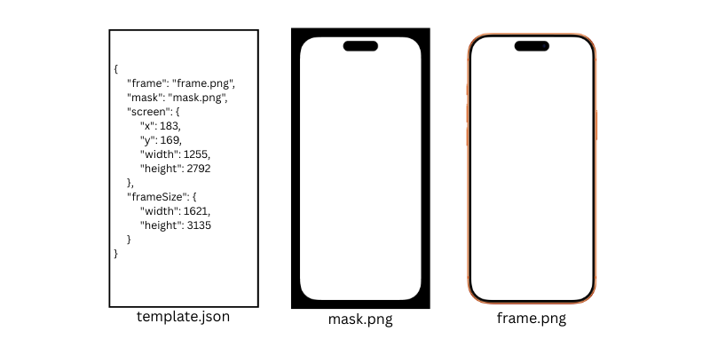
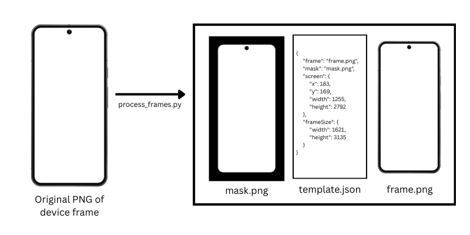

# Device Frames Media
This repository contains data for common Apple/Android device frames.
For each device, it contains a
 - PNG of the device frame
 - PNG of the mask of the frame
 - JSON file with metadata  

**Example of Frame, Template, and Mask**


This data is stored within `device-frames-output`, which has this structure:
```
device-frames-output/
├── {device-type}/                (android-phone, android-tablet, iOS, or iPad)
│   └── {device-model}/           (ex: 17 Pro Max, iPad mini 8.3, Pixel 9 Pro XL)
│       └── {variant}/            (ex: Cosmic Orange, Blue, Titanium)
│           ├── frame.png         (original frame, RGBA, transparent background)
│           ├── mask.png          (binary screen mask, grayscale)
│           └── template.json     (metadata: coordinates, sizes)
```


**Example template.json**
```json
{
  "frame": "frame.png",            (RGBA frame image)
  "mask": "mask.png",              (binary screen mask: white=screen, black=everything else, such as background or notches)
  "screen": {
    "x": 183,                      (screen top-left x)
    "y": 169,                      (screen top-left y)
    "width": 1145,                 (screen width)
    "height": 2549                 (screen height)
  },
  "frameSize": {
    "width": 1511,                 (full frame width)
    "height": 2896                 (full frame height)
  }
}
```

  [**Generated index.json**](https://raw.githubusercontent.com/jonnyjackson26/device-frames-media/main/device-frames-output/index.json)

  Running `process_frames.py` also creates `device-frames-output/index.json`, which contains all frames in a nested lookup structure:

  - `{device-type}` key in kebab-case (example: `ios`, `android-phone`)
  - `{device-model}` key in kebab-case (example: `17-pro-max`)
  - `{variant}` key in kebab-case (example: `cosmic-orange`)

  Each variant includes hosted URLs and template metadata:

  ```json
  {
    "ios": {
      "17-pro-max": {
        "cosmic-orange": {
          "frame": "https://jonnyjackson26.github.io/device-frames-media/device-frames-output/iOS/17%20Pro%20Max/Cosmic%20Orange/frame.png",
          "mask": "https://jonnyjackson26.github.io/device-frames-media/device-frames-output/iOS/17%20Pro%20Max/Cosmic%20Orange/mask.png",
          "screen": {
            "x": 100,
            "y": 100,
            "width": 1320,
            "height": 2868
          },
          "frameSize": {
            "width": 1520,
            "height": 3068
          }
        }
      }
    }
  }
  ```

This data is created from raw PNGs of device frames (`device-frames-raw`) with the script `process_frames.py`.  
  

**Algorithm Overview**

#### Step 1: Normalize Image
- Load PNG and convert to RGBA
- Extract alpha channel (0-255 range)

#### Step 2: Classify Pixels by Opacity
- **Transparent** (α ≤ 10): Screen interior
- **Solid** (α ≥ 245): Device frame
- **Edge/anti-aliased**: Everything in between

#### Step 3: Find Contiguous Transparent Regions
- Connected-component labeling on transparency mask
- Identify all transparent regions with their areas
- Reject regions touching image borders (background)
- Reject tiny regions (holes, speaker grills, < 5000 pixels)

#### Step 4: Select Screen Candidate
Chooses the region with:
- Largest area
- Aspect ratio within 1.3-2.5 range (phones & tablets)
- Fully enclosed by opaque pixels

#### Step 5-6: Extract Bounds & Contour
- Calculate minX, minY, maxX, maxY of selected region
- Generate bounding box
- Extract precise screen contour using edge detection

#### Step 7: Generate Screen Mask
- Create blank image (frame size)
- Fill detected contour with white (255)
- Fill background with black (0)
- Feather inward by ~1px to avoid edge bleed


# Installation
```
pip install -r requirements.txt
python process_frames.py
```

By default, `process_frames.py` is incremental: it only processes PNGs that are new or changed since their generated outputs were last written, and it prunes generated outputs for raw PNGs that were removed or renamed.

To fully regenerate all outputs, delete `device-frames-output` and run `python process_frames.py` again.

# Contributing
Please add more device frames to expand the dataset.
1. Add the frame PNG to the appropriate spot in device-frames-raw
2. Push your branch (or open a PR) and GitHub Actions will automatically run `process_frames.py` and regenerate the device list below

# TODO:
=========================================================================
fix "color" and "ios" to be apple iphone
Consider removing generated template.json files, i think they're useless

# List of Devices and Variations
**iOS:**

 - 8
   - [Gold](https://github.com/jonnyjackson26/device-frames-media/tree/main/device-frames-output/iOS/8/Gold), [Silver](https://github.com/jonnyjackson26/device-frames-media/tree/main/device-frames-output/iOS/8/Silver), [Space Grey](https://github.com/jonnyjackson26/device-frames-media/tree/main/device-frames-output/iOS/8/Space%20Grey)
 - 13 mini
   - [Black](https://github.com/jonnyjackson26/device-frames-media/tree/main/device-frames-output/iOS/13%20mini/Black), [Blue](https://github.com/jonnyjackson26/device-frames-media/tree/main/device-frames-output/iOS/13%20mini/Blue), [Pink](https://github.com/jonnyjackson26/device-frames-media/tree/main/device-frames-output/iOS/13%20mini/Pink), [Product (RED)](https://github.com/jonnyjackson26/device-frames-media/tree/main/device-frames-output/iOS/13%20mini/Product%20%28RED%29), [Starlight](https://github.com/jonnyjackson26/device-frames-media/tree/main/device-frames-output/iOS/13%20mini/Starlight)
 - 14 Pro Max
   - [Deep Purple](https://github.com/jonnyjackson26/device-frames-media/tree/main/device-frames-output/iOS/14%20Pro%20Max/Deep%20Purple), [Deep Purple - Shadow](https://github.com/jonnyjackson26/device-frames-media/tree/main/device-frames-output/iOS/14%20Pro%20Max/Deep%20Purple%20-%20Shadow), [Gold](https://github.com/jonnyjackson26/device-frames-media/tree/main/device-frames-output/iOS/14%20Pro%20Max/Gold), [Gold - Shadow](https://github.com/jonnyjackson26/device-frames-media/tree/main/device-frames-output/iOS/14%20Pro%20Max/Gold%20-%20Shadow), [Silver](https://github.com/jonnyjackson26/device-frames-media/tree/main/device-frames-output/iOS/14%20Pro%20Max/Silver), [Silver - Shadow](https://github.com/jonnyjackson26/device-frames-media/tree/main/device-frames-output/iOS/14%20Pro%20Max/Silver%20-%20Shadow), [Space Black](https://github.com/jonnyjackson26/device-frames-media/tree/main/device-frames-output/iOS/14%20Pro%20Max/Space%20Black), [Space Black - Shadow](https://github.com/jonnyjackson26/device-frames-media/tree/main/device-frames-output/iOS/14%20Pro%20Max/Space%20Black%20-%20Shadow)
 - 15 Pro Max
   - [Black Titanium](https://github.com/jonnyjackson26/device-frames-media/tree/main/device-frames-output/iOS/15%20Pro%20Max/Black%20Titanium), [Blue Titanium](https://github.com/jonnyjackson26/device-frames-media/tree/main/device-frames-output/iOS/15%20Pro%20Max/Blue%20Titanium), [Natural Titanium](https://github.com/jonnyjackson26/device-frames-media/tree/main/device-frames-output/iOS/15%20Pro%20Max/Natural%20Titanium), [White Titanium](https://github.com/jonnyjackson26/device-frames-media/tree/main/device-frames-output/iOS/15%20Pro%20Max/White%20Titanium)
 - 16
   - [Black](https://github.com/jonnyjackson26/device-frames-media/tree/main/device-frames-output/iOS/16/Black), [Pink](https://github.com/jonnyjackson26/device-frames-media/tree/main/device-frames-output/iOS/16/Pink), [Teal](https://github.com/jonnyjackson26/device-frames-media/tree/main/device-frames-output/iOS/16/Teal), [Ultramarine](https://github.com/jonnyjackson26/device-frames-media/tree/main/device-frames-output/iOS/16/Ultramarine), [White](https://github.com/jonnyjackson26/device-frames-media/tree/main/device-frames-output/iOS/16/White)
 - 16 Plus
   - [Black](https://github.com/jonnyjackson26/device-frames-media/tree/main/device-frames-output/iOS/16%20Plus/Black), [Pink](https://github.com/jonnyjackson26/device-frames-media/tree/main/device-frames-output/iOS/16%20Plus/Pink), [Teal](https://github.com/jonnyjackson26/device-frames-media/tree/main/device-frames-output/iOS/16%20Plus/Teal), [Ultramarine](https://github.com/jonnyjackson26/device-frames-media/tree/main/device-frames-output/iOS/16%20Plus/Ultramarine), [White](https://github.com/jonnyjackson26/device-frames-media/tree/main/device-frames-output/iOS/16%20Plus/White)
 - 16 Pro
   - [Black Titanium](https://github.com/jonnyjackson26/device-frames-media/tree/main/device-frames-output/iOS/16%20Pro/Black%20Titanium), [Desert Titanium](https://github.com/jonnyjackson26/device-frames-media/tree/main/device-frames-output/iOS/16%20Pro/Desert%20Titanium), [Natural Titanium](https://github.com/jonnyjackson26/device-frames-media/tree/main/device-frames-output/iOS/16%20Pro/Natural%20Titanium), [White Titanium](https://github.com/jonnyjackson26/device-frames-media/tree/main/device-frames-output/iOS/16%20Pro/White%20Titanium)
 - 16 Pro Max
   - [Black Titanium](https://github.com/jonnyjackson26/device-frames-media/tree/main/device-frames-output/iOS/16%20Pro%20Max/Black%20Titanium), [Desert Titanium](https://github.com/jonnyjackson26/device-frames-media/tree/main/device-frames-output/iOS/16%20Pro%20Max/Desert%20Titanium), [Natural Titanium](https://github.com/jonnyjackson26/device-frames-media/tree/main/device-frames-output/iOS/16%20Pro%20Max/Natural%20Titanium), [White Titanium](https://github.com/jonnyjackson26/device-frames-media/tree/main/device-frames-output/iOS/16%20Pro%20Max/White%20Titanium)
 - 17 Pro
   - [Cosmic Orange](https://github.com/jonnyjackson26/device-frames-media/tree/main/device-frames-output/iOS/17%20Pro/Cosmic%20Orange), [Deep Blue](https://github.com/jonnyjackson26/device-frames-media/tree/main/device-frames-output/iOS/17%20Pro/Deep%20Blue), [Silver](https://github.com/jonnyjackson26/device-frames-media/tree/main/device-frames-output/iOS/17%20Pro/Silver)
 - 17 Pro Max
   - [Cosmic Orange](https://github.com/jonnyjackson26/device-frames-media/tree/main/device-frames-output/iOS/17%20Pro%20Max/Cosmic%20Orange), [Deep Blue](https://github.com/jonnyjackson26/device-frames-media/tree/main/device-frames-output/iOS/17%20Pro%20Max/Deep%20Blue), [Silver](https://github.com/jonnyjackson26/device-frames-media/tree/main/device-frames-output/iOS/17%20Pro%20Max/Silver)
 - Air
   - [Cloud White](https://github.com/jonnyjackson26/device-frames-media/tree/main/device-frames-output/iOS/Air/Cloud%20White), [Light Gold](https://github.com/jonnyjackson26/device-frames-media/tree/main/device-frames-output/iOS/Air/Light%20Gold), [Sky Blue](https://github.com/jonnyjackson26/device-frames-media/tree/main/device-frames-output/iOS/Air/Sky%20Blue), [Space Black](https://github.com/jonnyjackson26/device-frames-media/tree/main/device-frames-output/iOS/Air/Space%20Black)

**iPad:**

 - iPad Air 11 M2 & M3
   - [Blue](https://github.com/jonnyjackson26/device-frames-media/tree/main/device-frames-output/iPad/iPad%20Air%2011%20M2%20%26%20M3/Blue), [Blue2](https://github.com/jonnyjackson26/device-frames-media/tree/main/device-frames-output/iPad/iPad%20Air%2011%20M2%20%26%20M3/Blue2), [Lavender](https://github.com/jonnyjackson26/device-frames-media/tree/main/device-frames-output/iPad/iPad%20Air%2011%20M2%20%26%20M3/Lavender), [Lavender2](https://github.com/jonnyjackson26/device-frames-media/tree/main/device-frames-output/iPad/iPad%20Air%2011%20M2%20%26%20M3/Lavender2), [Space Gray](https://github.com/jonnyjackson26/device-frames-media/tree/main/device-frames-output/iPad/iPad%20Air%2011%20M2%20%26%20M3/Space%20Gray), [Space Gray2](https://github.com/jonnyjackson26/device-frames-media/tree/main/device-frames-output/iPad/iPad%20Air%2011%20M2%20%26%20M3/Space%20Gray2), [Stardust](https://github.com/jonnyjackson26/device-frames-media/tree/main/device-frames-output/iPad/iPad%20Air%2011%20M2%20%26%20M3/Stardust), [Stardust2](https://github.com/jonnyjackson26/device-frames-media/tree/main/device-frames-output/iPad/iPad%20Air%2011%20M2%20%26%20M3/Stardust2)
 - iPad Air 13 M2 & M3
   - [Blue](https://github.com/jonnyjackson26/device-frames-media/tree/main/device-frames-output/iPad/iPad%20Air%2013%20M2%20%26%20M3/Blue), [Blue2](https://github.com/jonnyjackson26/device-frames-media/tree/main/device-frames-output/iPad/iPad%20Air%2013%20M2%20%26%20M3/Blue2), [Lavender](https://github.com/jonnyjackson26/device-frames-media/tree/main/device-frames-output/iPad/iPad%20Air%2013%20M2%20%26%20M3/Lavender), [Lavender2](https://github.com/jonnyjackson26/device-frames-media/tree/main/device-frames-output/iPad/iPad%20Air%2013%20M2%20%26%20M3/Lavender2), [Space Gray](https://github.com/jonnyjackson26/device-frames-media/tree/main/device-frames-output/iPad/iPad%20Air%2013%20M2%20%26%20M3/Space%20Gray), [Space Gray2](https://github.com/jonnyjackson26/device-frames-media/tree/main/device-frames-output/iPad/iPad%20Air%2013%20M2%20%26%20M3/Space%20Gray2), [Stardust](https://github.com/jonnyjackson26/device-frames-media/tree/main/device-frames-output/iPad/iPad%20Air%2013%20M2%20%26%20M3/Stardust), [Stardust2](https://github.com/jonnyjackson26/device-frames-media/tree/main/device-frames-output/iPad/iPad%20Air%2013%20M2%20%26%20M3/Stardust2)
 - iPad Air - 10.9 M1
   - [Blue](https://github.com/jonnyjackson26/device-frames-media/tree/main/device-frames-output/iPad/iPad%20Air%20-%2010.9%20M1/Blue), [Blue 2](https://github.com/jonnyjackson26/device-frames-media/tree/main/device-frames-output/iPad/iPad%20Air%20-%2010.9%20M1/Blue%202), [Green](https://github.com/jonnyjackson26/device-frames-media/tree/main/device-frames-output/iPad/iPad%20Air%20-%2010.9%20M1/Green), [Green 2](https://github.com/jonnyjackson26/device-frames-media/tree/main/device-frames-output/iPad/iPad%20Air%20-%2010.9%20M1/Green%202), [Rose Gold](https://github.com/jonnyjackson26/device-frames-media/tree/main/device-frames-output/iPad/iPad%20Air%20-%2010.9%20M1/Rose%20Gold), [Rose Gold 2](https://github.com/jonnyjackson26/device-frames-media/tree/main/device-frames-output/iPad/iPad%20Air%20-%2010.9%20M1/Rose%20Gold%202), [Silver](https://github.com/jonnyjackson26/device-frames-media/tree/main/device-frames-output/iPad/iPad%20Air%20-%2010.9%20M1/Silver), [Silver 2](https://github.com/jonnyjackson26/device-frames-media/tree/main/device-frames-output/iPad/iPad%20Air%20-%2010.9%20M1/Silver%202), [Space Grey](https://github.com/jonnyjackson26/device-frames-media/tree/main/device-frames-output/iPad/iPad%20Air%20-%2010.9%20M1/Space%20Grey), [Space Grey 2](https://github.com/jonnyjackson26/device-frames-media/tree/main/device-frames-output/iPad/iPad%20Air%20-%2010.9%20M1/Space%20Grey%202)
 - iPad Air- 10.9 M1
   - [Blue](https://github.com/jonnyjackson26/device-frames-media/tree/main/device-frames-output/iPad/iPad%20Air-%2010.9%20M1/Blue), [Blue 2](https://github.com/jonnyjackson26/device-frames-media/tree/main/device-frames-output/iPad/iPad%20Air-%2010.9%20M1/Blue%202), [Green](https://github.com/jonnyjackson26/device-frames-media/tree/main/device-frames-output/iPad/iPad%20Air-%2010.9%20M1/Green), [Green 2](https://github.com/jonnyjackson26/device-frames-media/tree/main/device-frames-output/iPad/iPad%20Air-%2010.9%20M1/Green%202), [Rose Gold](https://github.com/jonnyjackson26/device-frames-media/tree/main/device-frames-output/iPad/iPad%20Air-%2010.9%20M1/Rose%20Gold), [Rose Gold 2](https://github.com/jonnyjackson26/device-frames-media/tree/main/device-frames-output/iPad/iPad%20Air-%2010.9%20M1/Rose%20Gold%202), [Silver](https://github.com/jonnyjackson26/device-frames-media/tree/main/device-frames-output/iPad/iPad%20Air-%2010.9%20M1/Silver), [Silver 2](https://github.com/jonnyjackson26/device-frames-media/tree/main/device-frames-output/iPad/iPad%20Air-%2010.9%20M1/Silver%202), [Space Grey](https://github.com/jonnyjackson26/device-frames-media/tree/main/device-frames-output/iPad/iPad%20Air-%2010.9%20M1/Space%20Grey), [Space Grey 2](https://github.com/jonnyjackson26/device-frames-media/tree/main/device-frames-output/iPad/iPad%20Air-%2010.9%20M1/Space%20Grey%202)
 - iPad mini 8.3 A17 Pro
   - [Starlight](https://github.com/jonnyjackson26/device-frames-media/tree/main/device-frames-output/iPad/iPad%20mini%208.3%20A17%20Pro/Starlight), [Starlight2](https://github.com/jonnyjackson26/device-frames-media/tree/main/device-frames-output/iPad/iPad%20mini%208.3%20A17%20Pro/Starlight2)
 - iPad Pro 11 A12X to M2
   - [Landscape - Silver](https://github.com/jonnyjackson26/device-frames-media/tree/main/device-frames-output/iPad/iPad%20Pro%2011%20A12X%20to%20M2/Landscape%20-%20Silver), [Landscape - Silver - Pencil](https://github.com/jonnyjackson26/device-frames-media/tree/main/device-frames-output/iPad/iPad%20Pro%2011%20A12X%20to%20M2/Landscape%20-%20Silver%20-%20Pencil), [Landscape - Space Grey](https://github.com/jonnyjackson26/device-frames-media/tree/main/device-frames-output/iPad/iPad%20Pro%2011%20A12X%20to%20M2/Landscape%20-%20Space%20Grey), [Landscape - Space Grey - Pencil](https://github.com/jonnyjackson26/device-frames-media/tree/main/device-frames-output/iPad/iPad%20Pro%2011%20A12X%20to%20M2/Landscape%20-%20Space%20Grey%20-%20Pencil), [Portrait - Silver](https://github.com/jonnyjackson26/device-frames-media/tree/main/device-frames-output/iPad/iPad%20Pro%2011%20A12X%20to%20M2/Portrait%20-%20Silver), [Portrait - Silver - Pencil](https://github.com/jonnyjackson26/device-frames-media/tree/main/device-frames-output/iPad/iPad%20Pro%2011%20A12X%20to%20M2/Portrait%20-%20Silver%20-%20Pencil), [Portrait - Space Grey](https://github.com/jonnyjackson26/device-frames-media/tree/main/device-frames-output/iPad/iPad%20Pro%2011%20A12X%20to%20M2/Portrait%20-%20Space%20Grey), [Portrait - Space Grey - Pencil](https://github.com/jonnyjackson26/device-frames-media/tree/main/device-frames-output/iPad/iPad%20Pro%2011%20A12X%20to%20M2/Portrait%20-%20Space%20Grey%20-%20Pencil)
 - iPad Pro 11 M4 & M5
   - [Landscape - Silver](https://github.com/jonnyjackson26/device-frames-media/tree/main/device-frames-output/iPad/iPad%20Pro%2011%20M4%20%26%20M5/Landscape%20-%20Silver), [Landscape - Space Black](https://github.com/jonnyjackson26/device-frames-media/tree/main/device-frames-output/iPad/iPad%20Pro%2011%20M4%20%26%20M5/Landscape%20-%20Space%20Black), [Portrait - Silver](https://github.com/jonnyjackson26/device-frames-media/tree/main/device-frames-output/iPad/iPad%20Pro%2011%20M4%20%26%20M5/Portrait%20-%20Silver), [Portrait - Space Black](https://github.com/jonnyjackson26/device-frames-media/tree/main/device-frames-output/iPad/iPad%20Pro%2011%20M4%20%26%20M5/Portrait%20-%20Space%20Black)
 - iPad Pro 13 A12X to M2
   - [Landscape - Silver](https://github.com/jonnyjackson26/device-frames-media/tree/main/device-frames-output/iPad/iPad%20Pro%2013%20A12X%20to%20M2/Landscape%20-%20Silver), [Landscape - Silver - Pencil](https://github.com/jonnyjackson26/device-frames-media/tree/main/device-frames-output/iPad/iPad%20Pro%2013%20A12X%20to%20M2/Landscape%20-%20Silver%20-%20Pencil), [Landscape - Space Grey](https://github.com/jonnyjackson26/device-frames-media/tree/main/device-frames-output/iPad/iPad%20Pro%2013%20A12X%20to%20M2/Landscape%20-%20Space%20Grey), [Landscape - Space Grey - Pencil](https://github.com/jonnyjackson26/device-frames-media/tree/main/device-frames-output/iPad/iPad%20Pro%2013%20A12X%20to%20M2/Landscape%20-%20Space%20Grey%20-%20Pencil), [Portrait - Silver](https://github.com/jonnyjackson26/device-frames-media/tree/main/device-frames-output/iPad/iPad%20Pro%2013%20A12X%20to%20M2/Portrait%20-%20Silver), [Portrait - Silver - Pencil](https://github.com/jonnyjackson26/device-frames-media/tree/main/device-frames-output/iPad/iPad%20Pro%2013%20A12X%20to%20M2/Portrait%20-%20Silver%20-%20Pencil), [Portrait - Space Grey](https://github.com/jonnyjackson26/device-frames-media/tree/main/device-frames-output/iPad/iPad%20Pro%2013%20A12X%20to%20M2/Portrait%20-%20Space%20Grey), [Portrait - Space Grey - Pencil](https://github.com/jonnyjackson26/device-frames-media/tree/main/device-frames-output/iPad/iPad%20Pro%2013%20A12X%20to%20M2/Portrait%20-%20Space%20Grey%20-%20Pencil)
 - iPad Pro 13 M4 & M5
   - [Landscape - Silver](https://github.com/jonnyjackson26/device-frames-media/tree/main/device-frames-output/iPad/iPad%20Pro%2013%20M4%20%26%20M5/Landscape%20-%20Silver), [Landscape - Space Black](https://github.com/jonnyjackson26/device-frames-media/tree/main/device-frames-output/iPad/iPad%20Pro%2013%20M4%20%26%20M5/Landscape%20-%20Space%20Black), [Portrait - Silver](https://github.com/jonnyjackson26/device-frames-media/tree/main/device-frames-output/iPad/iPad%20Pro%2013%20M4%20%26%20M5/Portrait%20-%20Silver), [Portrait - Space Black](https://github.com/jonnyjackson26/device-frames-media/tree/main/device-frames-output/iPad/iPad%20Pro%2013%20M4%20%26%20M5/Portrait%20-%20Space%20Black)

**Android Phones:**

 - Pixel 8
   - [Hazel](https://github.com/jonnyjackson26/device-frames-media/tree/main/device-frames-output/android-phone/Pixel%208/Hazel)
 - Pixel 8 Pro
   - [Black](https://github.com/jonnyjackson26/device-frames-media/tree/main/device-frames-output/android-phone/Pixel%208%20Pro/Black), [Blue](https://github.com/jonnyjackson26/device-frames-media/tree/main/device-frames-output/android-phone/Pixel%208%20Pro/Blue), [Silver](https://github.com/jonnyjackson26/device-frames-media/tree/main/device-frames-output/android-phone/Pixel%208%20Pro/Silver)
 - Pixel 9 Pro
   - [Hazel](https://github.com/jonnyjackson26/device-frames-media/tree/main/device-frames-output/android-phone/Pixel%209%20Pro/Hazel), [Obsidian](https://github.com/jonnyjackson26/device-frames-media/tree/main/device-frames-output/android-phone/Pixel%209%20Pro/Obsidian), [Rose Quartz](https://github.com/jonnyjackson26/device-frames-media/tree/main/device-frames-output/android-phone/Pixel%209%20Pro/Rose%20Quartz)
 - Pixel 9 Pro XL
   - [Hazel](https://github.com/jonnyjackson26/device-frames-media/tree/main/device-frames-output/android-phone/Pixel%209%20Pro%20XL/Hazel), [Obsidian](https://github.com/jonnyjackson26/device-frames-media/tree/main/device-frames-output/android-phone/Pixel%209%20Pro%20XL/Obsidian), [Rose Quartz](https://github.com/jonnyjackson26/device-frames-media/tree/main/device-frames-output/android-phone/Pixel%209%20Pro%20XL/Rose%20Quartz)
 - Samsung Galaxy S21
   - [Black](https://github.com/jonnyjackson26/device-frames-media/tree/main/device-frames-output/android-phone/Samsung%20Galaxy%20S21/Black), [Pink](https://github.com/jonnyjackson26/device-frames-media/tree/main/device-frames-output/android-phone/Samsung%20Galaxy%20S21/Pink), [Violet](https://github.com/jonnyjackson26/device-frames-media/tree/main/device-frames-output/android-phone/Samsung%20Galaxy%20S21/Violet), [White](https://github.com/jonnyjackson26/device-frames-media/tree/main/device-frames-output/android-phone/Samsung%20Galaxy%20S21/White)

**Android Tablets:**

 - Pixel Tablet
   - [Hazel](https://github.com/jonnyjackson26/device-frames-media/tree/main/device-frames-output/android-tablet/Pixel%20Tablet/Hazel), [Porcelain](https://github.com/jonnyjackson26/device-frames-media/tree/main/device-frames-output/android-tablet/Pixel%20Tablet/Porcelain)
 - Samsung Galaxy Tab S11 Ultra
   - [Samsung Galaxy Tab S11 Ultra](https://github.com/jonnyjackson26/device-frames-media/tree/main/device-frames-output/android-tablet/Samsung%20Galaxy%20Tab%20S11%20Ultra/Samsung%20Galaxy%20Tab%20S11%20Ultra)
 - Samsung Galaxy Tab S11 Ultra copy
   - [ultraaaa](https://github.com/jonnyjackson26/device-frames-media/tree/main/device-frames-output/android-tablet/Samsung%20Galaxy%20Tab%20S11%20Ultra%20copy/ultraaaa)
